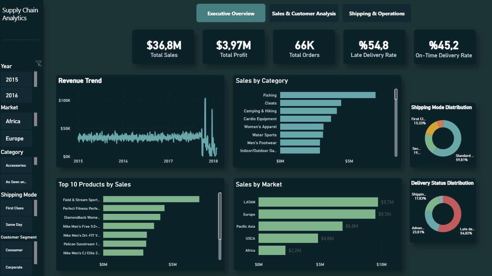
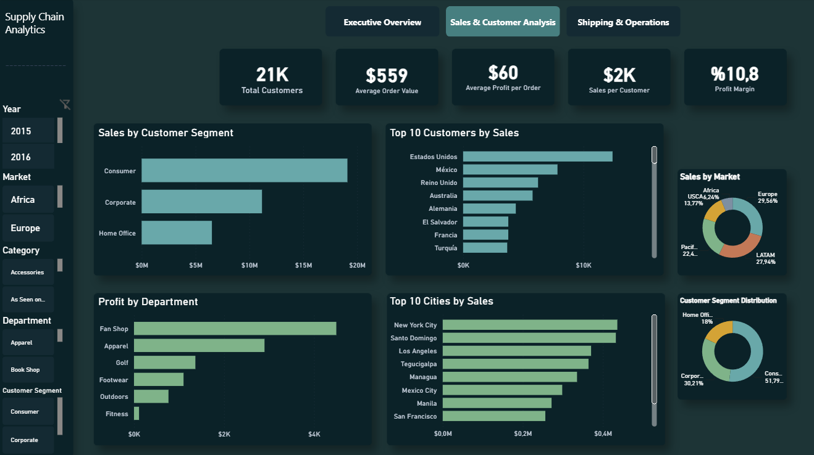
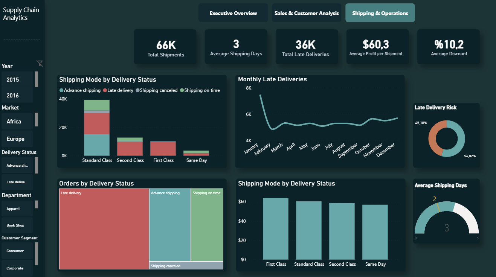

# 📦 Power BI Supply Chain Dashboard

An interactive Supply Chain Analytics dashboard built with **Power BI** to analyze sales performance, customer behavior, shipping operations, and delivery efficiency. The dashboard provides business insights through interactive visualizations, KPIs, and dynamic filtering.

---

## 🚀 Features

- Interactive multi-page dashboard
- Executive business overview
- Sales & customer analytics
- Shipping & logistics analysis
- Dynamic KPI cards
- DAX measures
- Power Query transformations
- Interactive slicers and filters
- Custom dashboard theme

---

## 🛠️ Technologies

- Power BI Desktop
- DAX
- Power Query
- Data Modeling
- Data Visualization

---

## 📊 Dashboard Pages

### Executive Overview

Provides a high-level overview of business performance including sales, profit, orders, product categories, markets, and delivery performance.

---

### Sales & Customer Analysis

Analyzes customer segments, profitability, average order value, sales distribution, and customer performance across different markets.

---

### Shipping & Operations

Monitors shipping performance, delivery risks, operational KPIs, shipping modes, and logistics efficiency.

---

## 📈 Key KPIs

- Total Sales
- Total Profit
- Total Orders
- Total Customers
- Average Order Value
- Profit Margin
- Total Shipments
- Average Shipping Days
- Late Delivery Rate
- On-Time Delivery Rate

---

## 📂 Dataset

**DataCo Smart Supply Chain Dataset**
https://www.kaggle.com/datasets/shashwatwork/dataco-smart-supply-chain-for-big-data-analysis

---

## 👨‍💻 Author

**Mehmet Ateş**

Business Intelligence Analyst | Power BI Developer

- LinkedIn: https://www.linkedin.com/in/mehmet-ateş-993007233
- GitHub: https://github.com/mehmetatesbi
